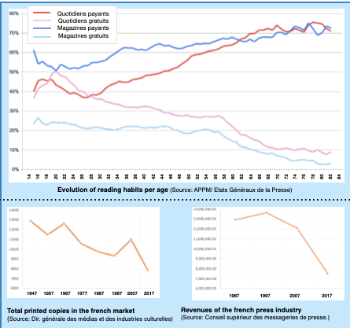

# Extraction of flyer-foundation.pdf
## To be used as resource to add context in chapter 1: industrial context

# Design preserving magnification: 
## A digital innovation to serve the press industry?

Faced with a structural crisis since the 2000s, the press faces major technological and economic challenges: the development of information media and online services, competition from free titles have permanently weakened the sector. With a turnover of 7.5 billion euros in 2017, newspaper publishers have lost 42% of their revenues since 1990. This decrease is explained by the decline in sales of paper copies, combined with that of advertising revenue. Over the period 1990-2015, advertising investments decreased overall by 61% (-59% for commercial advertising and -68% for classified ads). However, despite the decline in single-copy sales, subscription revenue grew by 27% between 1990 and 2017. 

### Seniors habits help the press industry to face the decline 
When the press industry will start to look for news subscriptors it will be important to highlight that most people paying currently for  subscriptions are people between 50 y.o and 80 y.o, those people with a strong printed content culture and attached to traditional media are an interesting target for newspapers.  50% of 65+y.o people buy a newspaper everyday and spend twice as much reading time as the rest of the French population.

### The digital potential

### 50.3% of the total revenue correspond to the digital revenues in The Guardian

For many years, newspaper publishers have simply wanted to exist on the web. This late awareness of the digital potential is slowly starting to pay, digital sales are progressing and these results encourage all industry players. In Europe, the digital shift in daily newspapers has become a reality with e-newspapers. For example, The Guardian had seen its circulation shrink considerably from 358,844 copies in 2009 to 207,958 copies in 2014 and 152,714 in 2018.  With the launch of a new  site in 2015, it remains one of the most read with more than 150 million unique visitors per month, thanks to a globalised two-thirds readership. In 2018, for the first time in its history, digital revenues surpassed those from paper: £108.6m for £107.5m. In any case, and a little bit late, the revolution is just beginning for the press industry. The digital world will continue radically transforming the entire value chain of this industry, but above all, it will transform how people are informed and how the media communicate.

